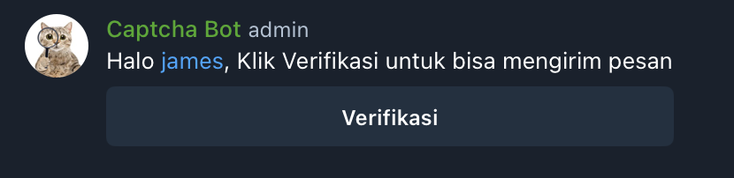
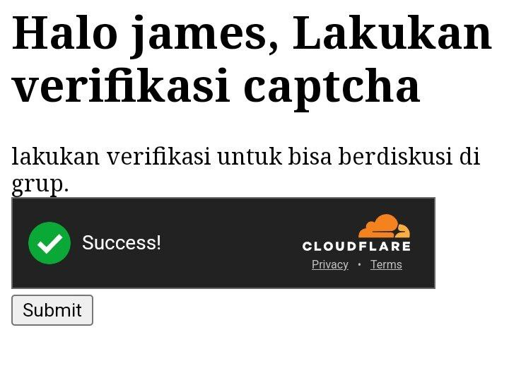

# Telegram Captcha Bot /w Cloudflare Turnstile

a captcha bot that leveraging telegram login api and cloudflare turnstile, add [@SvelteCaptchabot](https://t.me/@SvelteCaptchabot) to your group!

| Chat Preview         |     Site Preview      |
| -------------------- | :-------------------: |
|  |  |

## Edit

Due to worst quality of Telegram Webhook (sometimes Telegram just stop sending updates), I made another part that having task to getting the join service message, check the `bot-get-update` folder

## Technology

- [x] Telegram API
- [x] Baselime.io
- [x] Cloudflare D1
- [x] Cloudflare Pages
- [ ] Cloudflare Durable Object

## Schema Init

```sh
npm i
npx wrangler d1 create db-name
# paste the output inside wrangler.toml file
npx wrangler d1 execute db-name --remote --file=db.sql
```

## Bot Config @BotFather

1. make sure you turn off privacy config
2. setting's bot login domain with the same domain as webhook (for telegram auth purpose)

## Deployment

1. Deploy using Cloudflare Pages GUI
2. connect the forked version of this project
3. select `SvelteKit` preset
4. set environment variable (basically the same as .env.example)
5. Click "Deploy"
6. Access `yoursite.com/webhook/activate` to activate Telegram Webhook
